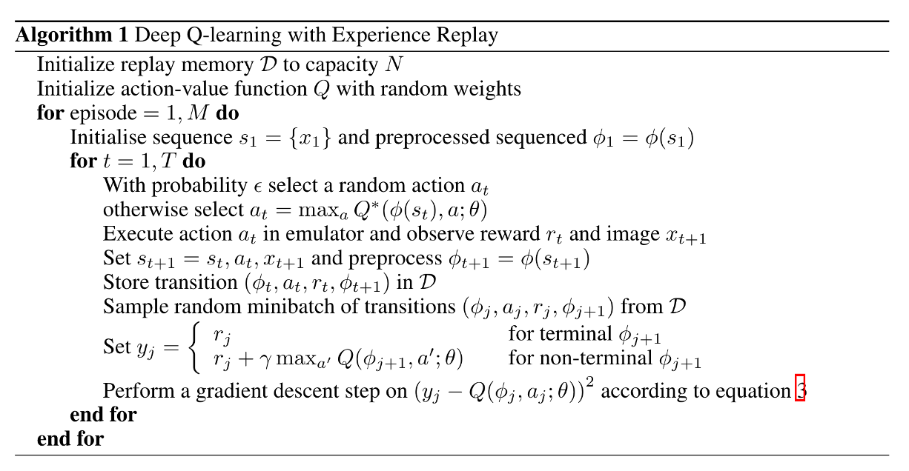

# Setting

## CartPole

As the agent observes the current state of the environment and chooses an action, the environment transitions to a new state, and also returns a reward that indicates the consequences of the action. In this task, **rewards are +1 for every incremental timestep** and the environment **terminates if the pole falls over too far or the cart moves more than 2.4 units away from center**. This means better performing scenarios will run for longer duration, accumulating larger return.
The CartPole task is designed so that the inputs to the agent are 4 real values representing the environment state (position, velocity, etc.). We take these 4 inputs without any scaling and pass them through a small fully-connected network with 2 outputs, one for each action. The network is trained to predict the expected value for each action, given the input state. The action with the highest expected value is then chosen.

# Run
cd DQN

`python3 script/main.py`

`python video/video_list.py `

`ffmpeg -f concat -safe 0 -i DQN/video/video_list.txt -c copy DQN/video/video.mp4`

# Algorithm

- "Initialize replay memory to capacity N"
    - DQN/infrastructure/experience_replay.py : experience replay
    - DQN/script/main.py | line 29 : initialize experience replay
    - DQN/infrastructure/config.py | line 21 : buffer memory size

- "Initialize action-value function Q with random weights"
    - DQN/model/DQN.py : DQN model
    - DQN/script/main.py | line 24 : initialize Q net

- "for episode = 1, M do"

- "Initialize sequence s_{1} = {x_{1}} and preprocessed sequenced ~"
    - DQN/script/main.py | line 40-43

- "for t = 1, T do"

- "With probability epsilon select a random action a_t"
    - DQN/policy/epsilon_greedy_policy.py | line 14 : epsilon greedy policy
    - DQN/script/main.py | line 46 : get optimal action

- "otherwise select a_t = max_{a} Q*(pi(s_t),a ; theta)"
    - DQN/policy/epsilon_greedy_policy.py | line 10-12 : optimal action given critic

- "Execute action a_t in emulator and observe reward r_t and image x_{t+1}"
    - DQN/script/main.py | line 48 : interaction with environment

- "Set s_{t+1} = s_t, a_t,x_{t+1} and preprocess ~"
    - DQN/script/main.py | line 50 : Get next state directly by environment (model-free)

- "Store transition (pi_t, a_t, r_t, pi_{t+1}) in memory"
    - DQN/script/main.py | line 55 : Store transition tuple to memory

- "Sample random minibatch of transitions (pi_t, a_t, r_t, pi_{t+1}) from memory"
    - DQN/infrastructure/utils.py | line 7-11 : By using replay buffer and sample, we can remove the correlation between observation sequence, smooth over change in data distribution

- "set target value"
    - DQN/infrastructure/utils.py | line 22 : Assigning the target value differs by termination. Another network(target network) using for Q not Q*

- "Peform a gradient descent step on loss function regarding target network and "
    - DQN/infrastructure/utils.py | line 25-29 : iterative update that adjusts the action-values (Q) towards target values that are only periodically updated, thereby reducing correlations with the target. Also allowing sgd rather than batch gd.
    
# Problem

- No need to clipping
- Fix config (epoch, episode, etc)